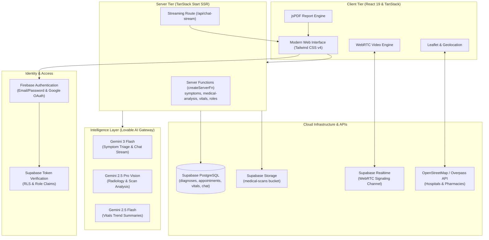

# 🩺 HealthVision AI
### *Intelligent Healthcare. Simplified for Everyone.*

🌐 **Live Production URL:** [https://healthvision-ai-eight.vercel.app](https://healthvision-ai-eight.vercel.app)

[](https://healthvision-ai-eight.vercel.app)
[](https://github.com/sinhatumpa84-rgb/HealthVision.AI)
[](https://tanstack.com/start)
[](https://tailwindcss.com/)
[](https://ai.google.dev/)
[](https://firebase.google.com/)
[](https://supabase.com/)
[](#-license)

---

## 📖 Table of Contents
1. [Project Overview](#-project-overview)
2. [The Problem](#-the-problem)
3. [The Solution](#-the-solution)
4. [Core Features](#-core-features)
5. [How It Works & Architecture](#-how-it-works--architecture)
6. [Technology Stack](#-technology-stack)
7. [Artificial Intelligence & Multimodal Vision](#-artificial-intelligence--multimodal-vision)
8. [UI & UX Highlights](#-ui--ux-highlights)
9. [Real-World Applications](#-real-world-applications)
10. [Future Scope](#-future-scope)
11. [Medical Disclaimer](#-medical-disclaimer)
12. [Project Structure](#-project-structure)
13. [Setup & Installation](#-setup--installation)
14. [Environment Variables](#-environment-variables)
15. [Project Status](#-project-status)
16. [Contributing](#-contributing)
17. [About the Developer](#-about-the-developer)
18. [Development Philosophy](#-my-development-philosophy)
19. [Connect With Me](#-connect-with-me)

---

## 🌟 Project Overview

**HealthVision AI** is a modern, full-stack, AI-powered healthcare platform engineered to make complex health information accessible, understandable, and actionable for everyday users and medical practitioners alike.

Rather than forcing users to navigate dense clinical jargon or fragmented health portals, HealthVision AI unifies intelligent health triage, medical scan analysis, longitudinal vitals tracking, real-time doctor teleconsultation, emergency navigation, and automated medical reporting into a single, cohesive digital experience.

Built with **React 19**, **TanStack Start (SSR)**, **Tailwind CSS v4**, **Supabase**, **Firebase Authentication**, and the **Google Gemini AI model family**, HealthVision AI bridges cutting-edge artificial intelligence with human-centric healthcare workflows.

> [!NOTE]
> **30-Second Summary:** HealthVision AI transforms symptom inputs, diagnostic imaging scans, and physiological vitals into clear, structured, clinical-grade insights—complete with instant PDF exports, WebRTC live doctor video consults, and emergency facility discovery.

---

## 🛑 The Problem

Navigating healthcare information in the digital age presents persistent challenges:

- **Complex Medical Terminology:** Clinical reports, imaging assessments, and lab readings are written for specialists, leaving patients confused and anxious.
- **Fragmented Health Data:** Symptom checks, physiological vitals, imaging archives, and doctor visits are scattered across separate portals, paper files, or disconnected apps.
- **Delayed Triage:** Patients frequently struggle to distinguish between mild discomfort and critical emergencies that demand immediate hospital intervention.
- **Access Barriers to Consultations:** Scheduling doctor visits often requires prolonged waits, while rural or remote individuals face geographical hurdles to quick medical advice.
- **Opaque Diagnostic Scans:** Patients receive X-ray, MRI, or CT films with little to no preliminary explanation while waiting days for specialist follow-ups.

---

## 💡 The Solution

HealthVision AI tackles these barriers through a structured pipeline: **Input → Intelligence → Understanding → Action**.

```
┌─────────────────────────────────┐
│       PATIENT / PRACTITIONER    │
└────────────────┬────────────────┘
                 │
                 ▼
┌─────────────────────────────────┐
│     HEALTH INPUT & SENSORS      │
│  • Symptoms & Severity          │
│  • X-Rays, MRIs, CTs, Derm      │
│  • Heart Rate, BP, SpO₂, Temp   │
└────────────────┬────────────────┘
                 │
                 ▼
┌─────────────────────────────────┐
│   INTELLIGENCE & VISION LAYER   │
│  • Gemini 3 Flash Triage        │
│  • Gemini 2.5 Pro Vision Scan   │
│  • Gemini 2.5 Flash Vitals Trend│
└────────────────┬────────────────┘
                 │
                 ▼
┌─────────────────────────────────┐
│  STRUCTURED CLINICAL INSIGHTS   │
│  • Risk Levels & Red Flags      │
│  • Likelihood Diagnoses         │
│  • Formal PDF Clinical Reports  │
└────────────────┬────────────────┘
                 │
                 ▼
┌─────────────────────────────────┐
│        EMPOWERED ACTION         │
│  • WebRTC P2P Video Consult     │
│  • Nearby Hospital/Pharma Maps  │
│  • Pan-India Emergency SOS      │
└─────────────────────────────────┘
```

### Problem → Solution → User Benefit

| Real-World Problem | HealthVision AI Solution | Direct User Benefit |
| :--- | :--- | :--- |
| **Incomprehensible scan reports** | Multimodal AI vision analysis with structured findings and impressions | Understand preliminary scan observations in plain language within seconds. |
| **Uncertain symptom severity** | Multi-attribute triage engine evaluating age, duration, sex, and severity scale | Receive clear risk categorization (`Low`, `Moderate`, `High`, `Emergency`) and actionable next steps. |
| **Isolated vital statistics** | Interactive Recharts trend charts with longitudinal AI status summaries | Identify vital patterns early (`Healthy`, `Monitor`, `Concern`, `Urgent`) before complications arise. |
| **Physical distance from clinics** | Browser-native WebRTC peer-to-peer live teleconsultation with doctor matching | Connect face-to-face with registered doctors with zero software installation. |
| **Acute emergency panic** | Geolocation-powered facility discovery and comprehensive 112/statewide SOS lines | Locate the nearest hospital or ambulance service instantly with turn-by-turn routing. |

---

## ✨ Core Features

Every feature listed below is **fully implemented** in the active codebase:

### 1. 🩺 AI Symptom Checker
- **Comprehensive Multi-Factor Triage:** Evaluates multi-symptom selections across categories (*General, Head & Neuro, Respiratory, Cardiac, Digestive, Skin & Joints*), additional contextual notes, patient age, biological sex, symptom duration (days), and severity slider (1–10).
- **Structured Clinical Output:** Returns an explicit risk level badge, plain-language summary, up to 5 ranked possible conditions with percentage likelihoods, recommended next steps, and red-flag emergency alerts.
- **Historical Persistence:** Automatically stores every assessment in the user's Supabase database profile for longitudinal review.

### 2. 🔬 Medical Image & Scan Analysis
- **Multimodal Radiographic Vision:** Accepts X-rays, CT scans, MRI scans, and skin/dermatology photos (up to 15 MB in JPG, PNG, WebP, or PDF format).
- **In-Depth Diagnostic Breakdown:** Generates preliminary radiological findings, overall clinical impressions, cautionary notes, and an AI confidence score (0–100%).
- **Cloud Scan Storage:** Uploads securely to isolated user directories within Supabase Storage (`medical-scans` bucket) using time-limited signed upload URLs.

### 3. 🖼️ Interactive Medical Scans Gallery
- **Visual Scan Library:** Displays all previously uploaded medical scans with thumbnail previews, scan categorization, and recording timestamps.
- **Deep Inspection Dialog:** Inspect high-resolution scans with complete findings, impressions, cautions, and direct links to full-resolution imagery.
- **Client-Side PDF Generation:** Instant one-click export of formal clinical reports via `jspdf`.

### 4. 💬 24/7 Real-Time Streaming Health Chat
- **Server-Sent Events (SSE):** Streaming conversational interface delivering rapid token-by-token responses without page reloads.
- **Markdown-Rich Formatting:** Renders clean typography, lists, bold concepts, and structured medical advice through `react-markdown`.
- **Chat Memory & Suggestions:** Persists conversation exchanges to Supabase (`chat_messages`), includes quick-inquiry suggestion chips, and provides a one-click history clearing option.

### 5. 📈 Vitals Tracker & AI Health Summary
- **Multi-Parameter Logging:** Records heart rate (bpm), blood pressure (systolic/diastolic mmHg), blood oxygen (SpO₂ %), and body temperature (°F).
- **Interactive Multi-Line Chart:** Dynamic time-series visualization built with `Recharts` showing concurrent fluctuations and historical metrics.
- **AI Trend Synthesis:** Analyzes the latest 20 vital readings to classify overall health status as `Healthy`, `Monitor`, `Concern`, or `Urgent`, highlighting flagged anomalies and physician-aligned recommendations.

### 6. 📹 Live WebRTC Doctor Teleconsultation
- **Zero-Plugin Video Calling:** Direct browser-to-browser peer-to-peer encrypted video and audio calling powered by native WebRTC.
- **Supabase Realtime Signaling:** Utilizes Supabase Realtime Channels (Broadcast and Presence) for exchange of SDP offers, answers, and ICE candidate negotiation.
- **Consultation Controls:** Real-time microphone mute/unmute, camera toggle, unique room code generation, copy-to-clipboard sharing, and call termination controls.

### 7. 📅 Role-Based Doctor & Patient Appointment System
- **Dual User Roles:** First-class role separation between `patient` and `doctor` with medical specialties (Cardiology, Dermatology, Neurology, Orthopedics, Pediatrics, Radiology, General Practice).
- **Patient Booking Flow:** Patients browse registered doctors, pick appointment dates/times, and add clinical visit notes.
- **Doctor Workflow:** Doctors review incoming appointment requests, accept or decline bookings, and automatically generate linked video consultation rooms upon acceptance.

### 8. 🗺️ Nearby Healthcare Facility Finder
- **Automatic Geolocation:** Uses HTML5 Geolocation API with high-accuracy positioning to locate the user.
- **Live Overpass API & OpenStreetMap Queries:** Dynamically discovers hospitals, emergency clinics, and pharmacies within a 3-kilometer radius.
- **Interactive Leaflet Map:** Displays color-coded interactive markers (red for hospitals/clinics, green for pharmacies) with popups showing distance (Haversine formula in km), direct phone dial links, and turn-by-turn directions.

### 9. 🚨 Pan-India Emergency SOS Directory
- **National Helplines:** Immediate one-tap dialing for All-in-One Emergency (`112`), Medical Emergency (`108` / `102`), Police (`100`), Fire (`101`), Women Helpline (`1091`), Child Helpline (`1098`), Mental Health KIRAN (`1800-599-0019`), and Blood Bank (`104`).
- **State-by-State Directory:** Searchable directory encompassing every Indian state and Union Territory with localized emergency and ambulance contact numbers.
- **Persistent SOS Modal Component:** Accessible from anywhere in the application for critical situations.

### 10. 📄 Automated Clinical PDF Report Generator
- **Hospital-Grade Layouts:** Generates formatted A4 PDF reports client-side using `jspdf` for both image analyses and symptom evaluations.
- **Standardized Sections:** Includes header branding, patient identifiers, timestamps, confidence scores, findings bullet points, impressions, caution boxes, and legal disclaimers.

### 11. 🌐 Bilingual Support & Theming
- **Internationalization (i18n):** Native language toggling between English (`en`) and Bengali (`bn` / বাংলা) across navigation, buttons, and gallery views, stored in `localStorage`.
- **Dark & Light Mode:** Tailored theme engine featuring dark mode default with light mode toggle and seamless CSS class switching.

---

## 🏗️ How It Works & Architecture

HealthVision AI is architected as a high-performance modern web application leveraging Server-Side Rendering (SSR) via **TanStack Start**, API routes, Supabase server functions, and an external AI Gateway.



### Workflow Pipeline
1. **Authentication:** User registers as either a patient or doctor via Firebase Auth (Email or Google OAuth). Authentication state is shared across sessions with metadata synced.
2. **Server Function Middleware:** TanStack Start server functions invoke `requireSupabaseAuth`, validating the JWT bearer token against Supabase Auth claims and establishing user context (`userId`, `supabase`).
3. **AI Processing:** Server functions prepare clinical system prompts and dispatch requests to the AI Gateway with structured function-calling schemas (`tools`).
4. **Data Persistence:** Responses are parsed deterministically via `extractToolJSON` and saved with Row-Level Security (RLS) into PostgreSQL tables.
5. **Real-Time Delivery:** Chat utilizes Server-Sent Events (SSE) for streaming text, while video consultations establish WebRTC peer connections using Supabase Realtime broadcast channels.

---

## 💻 Technology Stack

HealthVision AI uses only production-grade modern web technologies verified directly within the repository:

| Layer | Technology | Purpose |
| :--- | :--- | :--- |
| **Frontend Framework** | **React 19** (`react: ^19.2.0`) | Modern UI rendering with concurrent features and hook primitives |
| **Full-Stack Meta-Framework** | **TanStack Start** (`@tanstack/react-start`) | Full-stack SSR framework with server functions and type safety |
| **Client Routing** | **TanStack Router** (`@tanstack/react-router`) | File-based, fully type-safe client-side routing |
| **Data Fetching & State** | **TanStack Query** (`@tanstack/react-query`) | Server state caching, asynchronous mutations, and cache invalidation |
| **Styling & Design System** | **Tailwind CSS v4** (`tailwindcss: ^4.2.1`) | High-performance CSS engine with modern theme variables |
| **UI Primitives** | **Radix UI** | Accessible primitives (Dialogs, Tabs, Selects, Tooltips, Sliders, Avatars) |
| **Icons & Visuals** | **Lucide React** (`lucide-react`) | Consistent iconography across medical and UI components |
| **AI Models (Reasoning & Chat)** | **Google Gemini 3 Flash** | High-speed structured symptom triage and streaming conversational chat |
| **AI Models (Multimodal Vision)**| **Google Gemini 2.5 Pro** | Deep multimodal vision analysis for X-ray, CT, MRI, and skin images |
| **AI Models (Time-Series)** | **Google Gemini 2.5 Flash** | Quantitative physiological vitals analysis and health status classification |
| **AI Integration Gateway** | **Lovable AI Gateway** | Secure, OpenAI-compatible proxy interface to Google Gemini models |
| **Authentication** | **Firebase Auth** (`firebase: ^12.19.0`) | Email/password, Google OAuth popup, and password recovery |
| **Database** | **Supabase PostgreSQL** | Relational store with Row-Level Security (RLS) and custom PL/pgSQL triggers |
| **Object Storage** | **Supabase Storage** | Private, RLS-governed storage bucket (`medical-scans`) with signed URLs |
| **Realtime & Signaling** | **Supabase Realtime** | WebSocket broadcast channels and presence tracking for WebRTC signaling |
| **Teleconsultation** | **WebRTC API** | Browser-native encrypted peer-to-peer audio and video transmission |
| **Interactive Mapping** | **Leaflet** & **OpenStreetMap** | Interactive slippy map rendering with custom markers |
| **Geospatial Discovery** | **Overpass API** | Live Overpass QL queries for nearby hospitals, clinics, and pharmacies |
| **Data Visualization** | **Recharts** (`recharts: ^2.15.4`) | Responsive multi-metric SVG line charts for physiological trends |
| **Document Generation** | **jsPDF** (`jspdf: ^4.2.1`) | Client-side generation of downloadable A4 clinical PDF reports |
| **Build Tooling & Bundler** | **Vite 7** (`vite: ^7.3.1`) | Rapid development server and optimized ESM production build |
| **Deployment Target** | **Cloudflare Workers / Pages** | Edge SSR support configured via `@cloudflare/vite-plugin` and `wrangler.jsonc` |

---

## 🤖 Artificial Intelligence & Multimodal Vision

HealthVision AI treats Artificial Intelligence not as a cosmetic wrapper, but as an assistive clinical triage engine. Every AI interaction uses explicit system prompts, strict function schemas, and conservative medical safety rules.

```
┌────────────────────────────────────────────────────────────────────────┐
│                        AI CAPABILITY MATRIX                            │
├────────────────────────┬────────────────────────┬──────────────────────┤
│ Capability             │ Underlying Model       │ Output Format        │
├────────────────────────┼────────────────────────┼──────────────────────┤
│ Symptom Triage         │ Gemini 3 Flash         │ Function Tool Call   │
│ Medical Image Vision   │ Gemini 2.5 Pro         │ Function Tool Call   │
│ Vitals Trend Summary   │ Gemini 2.5 Flash       │ Function Tool Call   │
│ Health Chatbot         │ Gemini 3 Flash         │ Server-Sent Events   │
└────────────────────────┴────────────────────────┴──────────────────────┘
```

### 1. Symptom Assessment (`assessSymptoms`)
- **Input:** Age, biological sex, duration in days, severity rating (1–10), structured symptom array, and optional free-form notes.
- **Model:** `google/gemini-3-flash-preview`
- **Output:** Structured JSON schema via `report_assessment` tool:
  - `risk_level`: `"low"` | `"moderate"` | `"high"` | `"emergency"`
  - `summary`: Concise clinical interpretation
  - `possible_conditions`: Array of conditions with `likelihood` (0–100%) and `description`
  - `recommended_next_steps`: Actionable next steps
  - `red_flags`: High-priority symptoms requiring immediate emergency care
  - `disclaimer`: Strict informational notice

### 2. Medical Image Analysis (`analyzeMedicalImage`)
- **Input:** Base64-encoded data URI of medical scan (downloaded server-side from Supabase Storage) along with scan type (`xray`, `ct`, `mri`, `skin`, `other`) and optional clinical context.
- **Model:** `google/gemini-2.5-pro`
- **Output:** Structured JSON schema via `report_analysis` tool:
  - `findings`: Key radiological or dermatological observations
  - `impressions`: Overall clinical impression summary
  - `cautions`: Important diagnostic cautions or contraindications
  - `confidence`: Confidence rating (0–100%)
  - `disclaimer`: Non-diagnostic disclaimer

### 3. Vitals Trend Analysis (`summarizeVitals`)
- **Input:** Reverse-chronological table of the patient's recent vitals readings (Heart Rate, Blood Pressure, SpO₂, Temperature).
- **Model:** `google/gemini-2.5-flash`
- **Output:** Structured JSON schema via `vitals_summary` tool:
  - `status`: `"ok"` | `"watch"` | `"concern"` | `"urgent"`
  - `headline`: High-level trend summary title
  - `summary`: Clinical narrative explaining the trend
  - `recommendations`: Preventive and lifestyle suggestions
  - `flagged`: Explicit list of out-of-range readings

### 4. Interactive Health Chat (`/api/chat-stream`)
- **Input:** Multi-turn message history with user authentication bearer token.
- **Model:** `google/gemini-3-flash-preview`
- **Output:** Continuous text stream via Server-Sent Events (`text/event-stream`), rendered client-side using `react-markdown`.

---

## 🎨 UI & UX Highlights

The HealthVision AI interface is designed to reduce cognitive load and deliver immediate clarity:

- **Clean Visual Hierarchy:** Information cards with ample breathing room, high-contrast typography, and curated color palettes.
- **Contextual Risk Badging:** Color-coded status badges for instant recognition:
  - 🟢 **Low / Healthy:** Emerald accents
  - 🟡 **Moderate / Monitor:** Amber accents
  - 🟠 **High / Concern:** Orange accents
  - 🔴 **Emergency / Urgent:** Crimson / Destructive accents
- **Interactive Visualizations:** Responsive SVG line charts with tooltips and legends built with `Recharts`.
- **Integrated Slippy Maps:** Custom Leaflet circle markers with category-specific colors and interactive popups.
- **Toast Notifications:** Non-intrusive action feedback powered by `Sonner`.
- **Responsive Layout:** Optimized across desktop displays, tablets, and mobile smartphones with touch-friendly targets.
- **Accessibility & Themes:** Dark mode default with light mode toggle, adhering to accessible contrast ratios.

---

## 🌍 Real-World Applications

### Current Implemented Capabilities
- **At-Home Triage:** Individuals experiencing unclear symptoms can assess urgency and determine whether self-care, a clinic appointment, or emergency services are required.
- **Radiology Pre-Screening:** Patients can upload personal scans and receive an understandable preliminary breakdown while awaiting an official radiologist consultation.
- **Chronic Care Vitals Monitoring:** Hypertensive, diabetic, or post-operative patients can log vital signs daily and monitor multi-day trends.
- **Remote Telemedicine:** Patients in remote areas can connect face-to-face with registered doctors using browser-based WebRTC without downloading additional software.
- **Emergency Facility Discovery:** Anyone facing a health crisis can immediately identify the closest hospital, clinic, or pharmacy with phone numbers and map directions.

### Potential Future Applications
*(Identified as future research and development directions, not currently implemented)*
- Integration with regional Electronic Health Record (EHR / FHIR) systems.
- Automated prescription optical character recognition (OCR) and drug interaction checks.
- Direct wearable synchronization (Apple HealthKit, Google Health Connect, Garmin).
- Multi-party hospital video conference rooms for family and specialist rounds.

---

## 🔮 Future Scope

While the current implementation provides a complete, working digital healthcare experience, planned future expansions include:

- [ ] **Wearable Device Integration:** Direct synchronization with continuous heart rate monitors, pulse oximeters, and smartwatches.
- [ ] **Prescription & Medicine Analysis:** Uploading paper prescriptions to extract dosage schedules and check for contraindications.
- [ ] **Expanded Regional Languages:** Adding Hindi, Tamil, Telugu, and Spanish language translations to expand accessibility.
- [ ] **EHR / FHIR Export:** Exporting patient history in standardized FHIR formats for seamless integration with clinical hospital systems.
- [ ] **Native Mobile Builds:** Packaging the application for iOS and Android using Capacitor or React Native.
- [ ] **Doctor Verification Workflow:** Medical license validation and credential checks for practicing physicians.

---

## ⚠️ Medical Disclaimer

> [!CAUTION]
> **HealthVision AI is an educational, research, and assistive technological project.**
>
> - HealthVision AI is **NOT** a certified medical device and does **NOT** provide official medical diagnoses, clinical determinations, or prescriptions.
> - The information, triage suggestions, scan interpretations, and chat responses generated by HealthVision AI are for **informational and educational support only**.
> - **DO NOT** use this application as a replacement for consultation with a qualified doctor or healthcare professional.
> - If you are experiencing a medical emergency, severe chest pain, shortness of breath, heavy bleeding, or stroke-like symptoms, **immediately call 112 (in India) or your local emergency services.**

---

## 📂 Project Structure

```
HealthVision.AI/
├── .git/                                         # Git version control repository
├── README.md                                     # Project overview and documentation
└── Healthvision-AI--main/
    └── Healthvision-AI--main/
        └── Healthvision-AI--main/
            ├── .env                              # Environment variables (private keys)
            ├── .gitignore                        # Git ignore specifications
            ├── components.json                   # UI component registry configuration
            ├── package.json                      # Project dependencies & build scripts
            ├── tsconfig.json                     # TypeScript compiler options
            ├── vite.config.ts                    # Vite bundler & TanStack Start setup
            ├── wrangler.jsonc                    # Cloudflare Workers deployment config
            │
            ├── supabase/                         # Supabase configuration & migrations
            │   ├── config.toml                   # Local Supabase settings
            │   └── migrations/                   # PostgreSQL schema migrations
            │       ├── 20260523075333_*.sql      # Core tables (profiles, diagnoses, vitals, chat)
            │       ├── 20260524132748_*.sql      # Storage bucket (medical-scans) & RLS
            │       └── 20260530140319_*.sql      # User roles (patient, doctor) & appointments
            │
            └── src/                              # Application source code
                ├── server.ts                     # TanStack Start SSR entry point & error handler
                ├── start.ts                      # Client runtime start instance & middleware
                ├── router.tsx                    # TanStack Router configuration
                ├── styles.css                    # Tailwind CSS v4 design system styles
                │
                ├── assets/                       # Image assets and diagnostic illustrations
                │
                ├── components/                   # Reusable UI & healthcare components
                │   ├── Navbar.tsx                # Navigation header with i18n, theme & user menu
                │   ├── Footer.tsx                # Application footer
                │   ├── Logo.tsx                  # HealthVision AI brand logo
                │   ├── RiskBadge.tsx             # Risk severity badge component
                │   ├── SOSButton.tsx             # Floating emergency SOS modal component
                │   ├── auth/                     # Authentication components (Google button)
                │   └── ui/                       # Radix UI wrapper primitives (button, card, dialog...)
                │
                ├── contexts/                     # React Context providers
                │   ├── auth.tsx                  # Firebase auth listener & role provider
                │   ├── i18n.tsx                  # English / Bengali translation dictionary
                │   └── theme.tsx                 # Dark / light mode state manager
                │
                ├── firebase/                     # Firebase client configuration & methods
                │   ├── config.ts                 # Firebase app initialization
                │   └── auth.ts                   # Email & Google OAuth helper methods
                │
                ├── integrations/                 # Backend service integrations
                │   └── supabase/                 # Supabase client, types, and server middleware
                │
                ├── lib/                          # Core business logic & server functions
                │   ├── ai.server.ts              # Lovable AI Gateway client & tool parser
                │   ├── appointments.functions.ts # Appointment booking, acceptance & cancellation
                │   ├── chat.functions.ts         # Chat history listing & persistence
                │   ├── diagnoses.functions.ts    # Diagnosis retrieval & signed URL generation
                │   ├── emergency-data.ts         # National & statewise emergency hotline database
                │   ├── medical-analysis.functions.ts # Scan upload & Gemini 2.5 Pro vision analysis
                │   ├── pdf-report.ts             # jsPDF medical scan analysis report generator
                │   ├── roles.functions.ts        # Patient vs doctor role assignments
                │   ├── symptom-pdf.ts            # jsPDF symptom check report generator
                │   ├── symptoms.functions.ts     # Gemini 3 Flash symptom assessment triage
                │   └── vitals.functions.ts       # Vitals logging & Gemini 2.5 Flash trend summary
                │
                └── routes/                       # File-based routing tree
                    ├── __root.tsx                # HTML root document wrapper
                    ├── index.tsx                 # Landing page
                    ├── signin.tsx                # User sign-in page
                    ├── signup.tsx                # Patient/doctor registration page
                    ├── reset-password.tsx        # Password recovery page
                    │
                    ├── api/                      # Server-side API endpoints
                    │   └── chat-stream.ts        # Streaming chat endpoint (Server-Sent Events)
                    │
                    └── _authenticated/           # Authenticated application views
                        ├── dashboard.tsx         # User overview & quick-action hub
                        ├── symptom-checker.tsx   # Multi-factor AI symptom triage
                        ├── medical-analysis.tsx  # Medical scan upload & analysis
                        ├── scans.tsx             # Uploaded scan gallery & PDF download
                        ├── chatbot.tsx           # 24/7 streaming health chat interface
                        ├── vitals.tsx            # Vitals tracker with Recharts & AI summary
                        ├── consult.tsx           # WebRTC live P2P video teleconsultation
                        ├── appointments.tsx      # Patient/doctor appointment management
                        ├── nearby.tsx            # Leaflet map & Overpass facility locator
                        ├── emergency.tsx         # India national & state emergency directory
                        └── history.tsx           # Past symptom checks & PDF reports
```

---

## 🚀 Setup & Installation

Follow these steps to run HealthVision AI locally on your system:

### Prerequisites
- **Node.js**: v18.0.0 or later (v20+ recommended)
- **Package Manager**: `npm` (v9+) or `bun`
- A free **Supabase** project (for PostgreSQL database and Storage)
- A free **Firebase** project (for Firebase Authentication)

### 1. Clone the Repository
```bash
git clone https://github.com/sinhatumpa84-rgb/HealthVision.AI.git
cd HealthVision.AI/Healthvision-AI--main/Healthvision-AI--main/Healthvision-AI--main
```

### 2. Install Dependencies
```bash
npm install
```

### 3. Configure Environment Variables
Create a `.env` file in the project root by copying the required variables listed in the [Environment Variables](#-environment-variables) section below:
```bash
# Windows PowerShell
Copy-Item .env.example .env
```

### 4. Apply Database Migrations (Supabase)
Apply the SQL migration scripts located in `supabase/migrations/` to your Supabase SQL editor:
- `20260523075333_*.sql` (creates `profiles`, `diagnoses`, `appointments`, `chat_messages`, `vitals`)
- `20260524132748_*.sql` (creates `medical-scans` storage bucket and security policies)
- `20260530140319_*.sql` (creates `user_roles` enum and doctor appointment linking)

### 5. Start the Development Server
```bash
npm run dev
```
The application will launch locally at `http://localhost:3000` (or `http://localhost:5173`).

### 6. Build for Production
```bash
npm run build
npm run preview
```

---

## 🔑 Environment Variables

The project requires the following environment variables to function correctly. **Never commit secret keys or sensitive credentials to GitHub.**

| Variable | Required | Description |
| :--- | :---: | :--- |
| `VITE_SUPABASE_URL` | Yes | Supabase project API endpoint URL |
| `VITE_SUPABASE_PUBLISHABLE_KEY` | Yes | Supabase anonymous / publishable key |
| `VITE_SUPABASE_PROJECT_ID` | Yes | Supabase unique project reference identifier |
| `SUPABASE_URL` | Yes | Server-side Supabase project API URL |
| `SUPABASE_PUBLISHABLE_KEY` | Yes | Server-side Supabase publishable key |
| `VITE_FIREBASE_API_KEY` | Yes | Firebase Web API key for authentication |
| `VITE_FIREBASE_AUTH_DOMAIN` | Yes | Firebase auth domain (`<project>.firebaseapp.com`) |
| `VITE_FIREBASE_PROJECT_ID` | Yes | Firebase project ID |
| `VITE_FIREBASE_STORAGE_BUCKET`| Yes | Firebase storage bucket domain |
| `VITE_FIREBASE_MESSAGING_SENDER_ID` | Yes | Firebase cloud messaging sender ID |
| `VITE_FIREBASE_APP_ID` | Yes | Firebase registered Web Application ID |
| `VITE_FIREBASE_MEASUREMENT_ID` | Optional | Google Analytics / Firebase measurement ID |
| `LOVABLE_API_KEY` | Yes | AI Gateway API Key (provides access to Google Gemini models) |

---

## 📌 Project Status

### 🟢 Active Development

HealthVision AI is actively maintained and continually expanding.

- ✅ **Fully Functional in Current Release:**
  - AI Symptom Checker with multi-factor risk categorization
  - Multimodal Medical Scan Analysis (X-Ray, CT, MRI, Derm) with PDF export
  - Interactive Medical Scans Gallery with modal inspection
  - Streaming 24/7 AI Health Chat (SSE) with markdown formatting
  - Physiological Vitals Tracker with Recharts curves & Gemini trend summary
  - WebRTC Peer-to-Peer Live Video Teleconsultation
  - Patient / Doctor Role Management & Appointment Booking
  - Leaflet + Overpass Geolocation Nearby Facility Finder
  - Pan-India National & State Emergency Directory
  - English & Bengali (বাংলা) Bilingual Translations
  - Dark / Light Theme Engine

---

## 🤝 Contributing

Contributions to HealthVision AI are warmly welcomed! Please follow this workflow:

1. **Fork** the repository: Click the Fork button at the top right of this page.
2. **Create a branch**: `git checkout -b feature/amazing-feature`
3. **Make your changes**: Write clean, commented, and typed code.
4. **Test your code**: Verify UI responsiveness and server functions.
5. **Commit your changes**: `git commit -m 'feat: Add amazing new healthcare feature'`
6. **Push to branch**: `git push origin feature/amazing-feature`
7. **Open a Pull Request**: Submit your PR with a clear description of changes.

---

## 👨‍💻 About the Developer

### **Supratik Sinha**
*B.Tech in Information Technology | Software Developer & AI Enthusiast*

I am a developer interested in building practical technology at the intersection of:
**Artificial Intelligence × Web Development × Automation × Real-World Problem Solving**

My recent work includes projects involving:
- 🤖 **AI-Powered Applications:** Multimodal vision agents, generative interfaces, and intelligent assistants
- 🌐 **Full-Stack Web Platforms:** Modern, high-performance SSR architectures with React, Next.js, and TanStack Start
- 🧠 **LLM-Powered Automation:** Function-calling agents, streaming pipelines, and structured extraction
- 📊 **Intelligent Dashboards:** Real-time data visualization, telemetry, and time-series monitoring
- 🩺 **Healthcare Technology:** Responsible clinical triage tools and accessible digital health solutions
- 🔗 **Blockchain Applications:** Decentralized architectures and cryptographic verification
- 🦾 **Assistive Technology:** Accessible digital tools designed for diverse user groups
- 🛠️ **Hackathon Prototypes:** Converting bold concepts into battle-tested digital products

HealthVision AI represents my dedication to applying modern engineering to a domain where clarity, speed, and responsible innovation matter most.

---

## 💻 My Development Philosophy

I don't build software that only looks good in static mockups. My focus is on delivering systems that genuinely work, remain fast under pressure, and solve tangible human problems.

```
IDEA ↓ DESIGN ↓ DEVELOPMENT ↓ INTEGRATION ↓ TESTING ↓ ITERATION ↓ WORKING PRODUCT
```

- ⚙️ **Functionality First:** The product must work reliably from end to end.
- 🎯 **Human Clarity:** Technology must explain itself clearly to non-technical users.
- ⚡ **Performance:** Eliminate unnecessary bloat; keep interactions immediate and responsive.
- 🧩 **Modular Architecture:** Build clean, decoupled modules that can scale gracefully.
- 🔐 **Ethical Responsibility:** Especially in sensitive domains like health, treat information with extreme care.

---

## 📬 Connect With Me

Let's discuss technology, healthcare innovation, or potential collaborations:

- **LinkedIn:** [linkedin.com/in/supratik-sinha-923ba637b](https://www.linkedin.com/in/supratik-sinha-923ba637b)
- **Instagram:** [instagram.com/supratiksinha052](https://www.instagram.com/supratiksinha052)
- **Email:** [sinhatumpa84@gmail.com](mailto:sinhatumpa84@gmail.com)
- **GitHub:** [github.com/sinhatumpa84-rgb](https://github.com/sinhatumpa84-rgb)

---

## 📜 License

This project is provided for educational, research, and non-commercial development purposes. Please refer to the repository license for applicable terms.

---

<p align="center">
  <b>🩺 HealthVision AI</b><br/>
  <i>Intelligence for better understanding. Technology for better experiences.</i><br/>
  Made with ❤️ by <b>Supratik Sinha</b>
</p>
